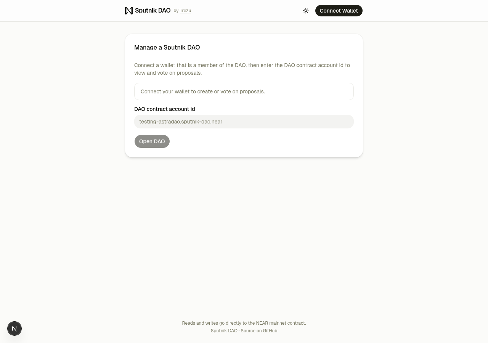
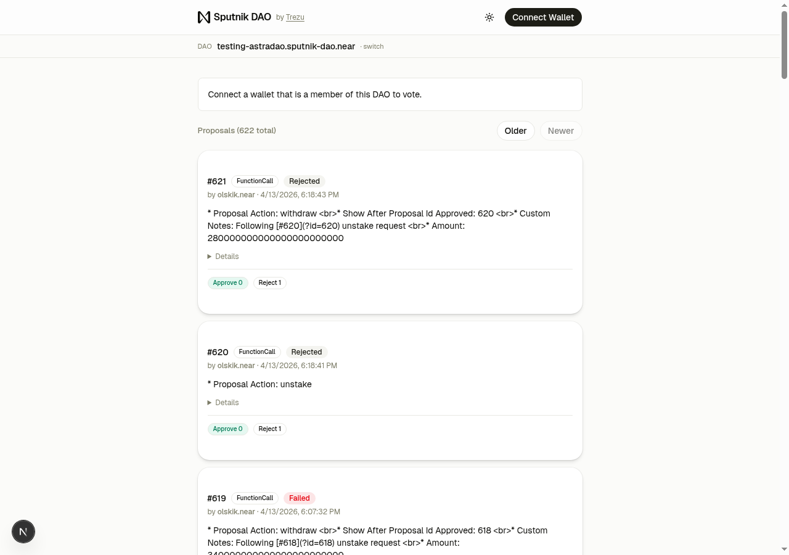
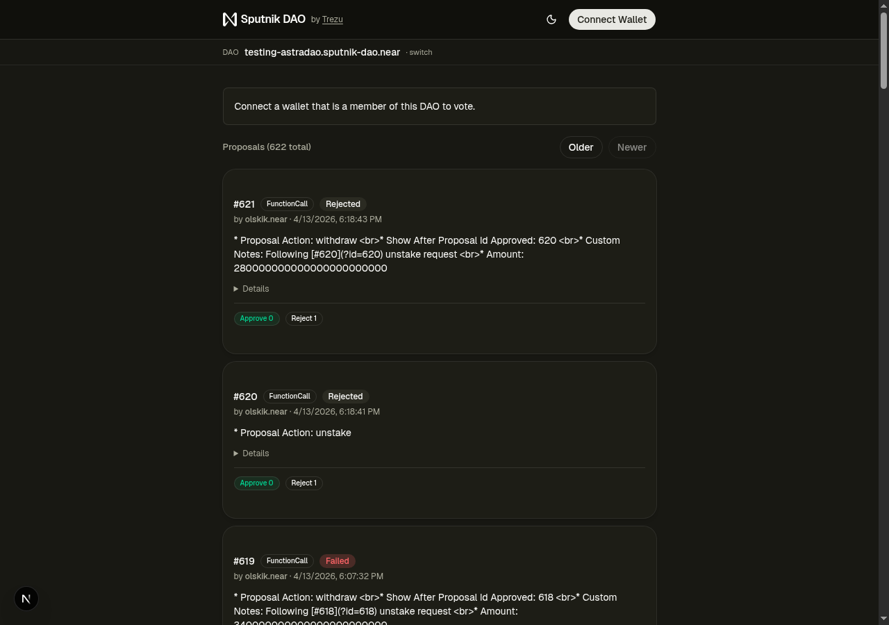
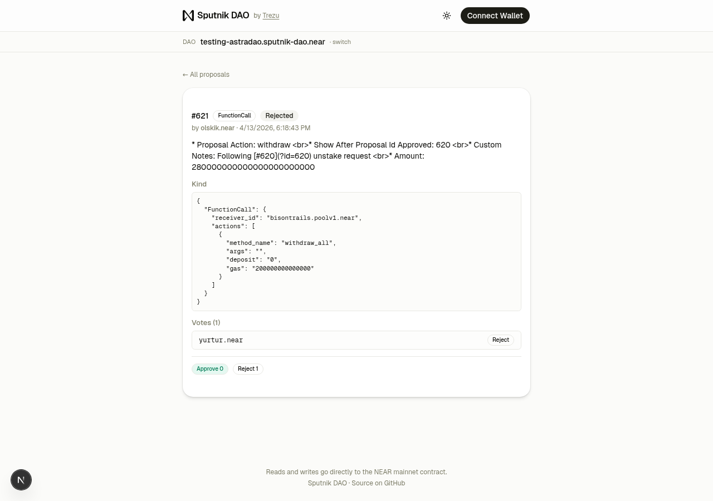
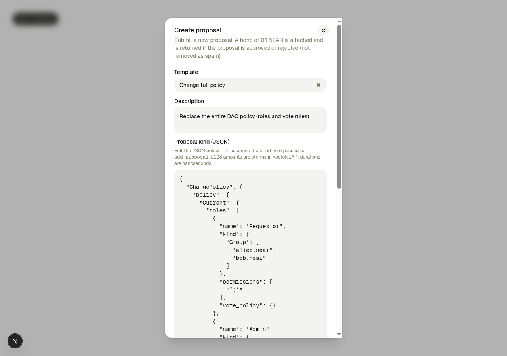

# Sputnik DAO

A web app for viewing, creating, and voting on proposals in any [Sputnik DAO](https://github.com/near-daos/sputnik-dao-contract) on NEAR Protocol — directly from the browser.

- 🌐 **Hosted at:** https://sputnik-dao.trezu.org
- 📦 **Source:** https://github.com/near-daos/sputnik-dao-ui
- ⛓️ **Contract reference:** https://github.com/near-daos/sputnik-dao-contract



*Landing page: enter any DAO contract account id (e.g. `testing-astradao.sputnik-dao.near`) to open its dashboard. Connect a NEAR wallet that is a member of the DAO to create and vote on proposals.*

## Features

- **Browse proposals** from any Sputnik DAO v2/v3 contract, newest first, with status badges, vote tallies, and inline `ProposalKind` JSON.
- **Proposal detail page** at `/<daoId>/<proposalId>` with the full proposer account, pretty-printed kind, and a per-voter table.
- **Create a proposal** with a template picker covering every `ProposalKind` — `Vote`, `Transfer`, `FunctionCall`, `AddMemberToRole`, `RemoveMemberFromRole`, `ChangeConfig`, `ChangePolicy` (prefilled from current on-chain policy), `ChangePolicyAddOrUpdateRole`, `ChangePolicyRemoveRole`, `ChangePolicyUpdateDefaultVotePolicy`, `ChangePolicyUpdateParameters`, `SetStakingContract`, `UpgradeSelf`, `UpgradeRemote`, `AddBounty`, `BountyDone`, `FactoryInfoUpdate`. The proposal bond is read from `get_policy` and attached exactly.
- **Vote Approve / Reject** on any in-progress proposal. The UI refetches after every transaction so tallies, status, and your vote record update without a page reload.
- **Role-aware UX** — reads `get_policy` and resolves the connected wallet's membership, so only members see the New Proposal button and only members eligible to vote on a given proposal see Approve/Reject.
- **Dark mode** — system-preference by default, with a header toggle that cycles Light → Dark → System.



*Dashboard for `testing-astradao.sputnik-dao.near` showing recent proposals, status badges, and vote tallies. Sign in as a DAO member to vote or to reveal the New Proposal button.*



*Same dashboard in dark mode.*



*Proposal detail page with the full `ProposalKind` JSON and per-voter breakdown.*



*New Proposal modal. The Template select covers every Sputnik proposal kind; `ChangePolicy` prefills with the current policy wrapped in `{"Current": ...}` so you only edit what you want to change.*

## Quick start

```bash
pnpm install
pnpm dev     # http://localhost:3000
pnpm build   # production build
pnpm lint    # eslint
```

Mainnet is the only network currently configured (see `src/app/providers.tsx`). To run against testnet, swap `createMainnetClient` → `createTestnetClient` and `networkId: "mainnet"` → `"testnet"` in that file.

## Usage

1. Open https://sputnik-dao.trezu.org.
2. Enter the DAO's contract account id (e.g. `yurtur.sputnik-dao.near`) and press **Open DAO**.
3. The dashboard lists every proposal, newest first. Click a proposal's `#ID` to see its detail page.
4. Click **Connect Wallet** and sign in with any NEAR-compatible wallet.
    - If your account is a member of the DAO, you'll see **New proposal** and per-proposal **Approve / Reject** buttons.
    - If not, you can still browse everything; actions stay hidden.
5. **New proposal** opens a dialog with a template picker and an editable JSON area. The proposal bond defined by the DAO's policy is attached to the transaction automatically.

## Contributing

See [CONTRIBUTING.md](./CONTRIBUTING.md) for dev-env setup, conventions, and the PR checklist. If you are an AI coding agent, also read [AGENTS.md](./AGENTS.md) — it encodes the non-obvious invariants of the Sputnik DAO contract and the libraries this app uses.

## License

MIT — see [LICENSE](./LICENSE).
